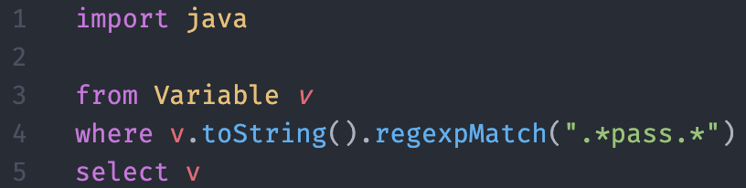

# What is CodeQL?

- CodeQL is advertised as a variant analysis tool.
- It is a query language which has its own syntax.
- It can be used to find a piece of code in a code base, not necessarily bugs or defects.
- It can be used as part of you CI/CD pipelines to detect bad smells.
- Free for research and open source

