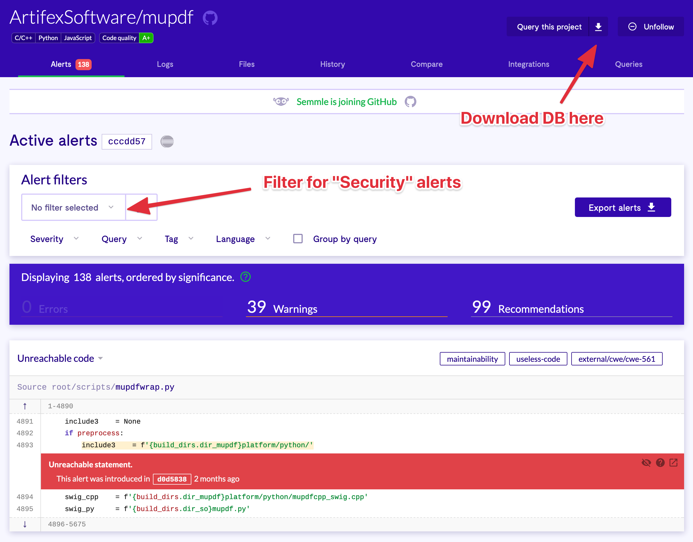

# Getting Started 🧐

CodeQL offers 2 ways to use their tool

1. CodeQL CLI for engineers
2. LGTM.com -> CodeQL Platform

## CodeQL CLI 🥂

Instructions: https://help.semmle.com/codeql/codeql-cli/procedures/get-started.html

- can compile a database for CodeQL locally
    - allowing engineers to do experiments and research locally
- can easily run batches on queries with ease

## LGTM.com 🖖

- can be used straight away on their platform for open source projects
- fancy UI
- a bit slower than querying locally, probably because of shared environment or some sort of restrictions
- once the project has been imported, the database can be exported

