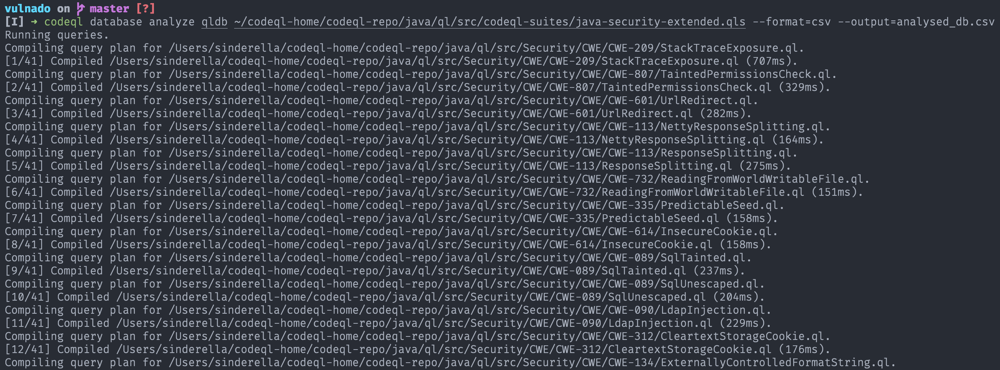

# Running the built-in queries 🧰

## Issues ⚠️

| Issue                                               | Type    | Location                                          | Line Number    |
| --------------------------------------------------- | ------- | ------------------------------------------------- | -------------- |
| Query built without neutralizing special characters | error   | /src/main/java/com/scalesec/vulnado/User.java     | 49, 40, 49, 44 |
| Use of a broken or risky cryptographic algorithm    | warning | /src/main/java/com/scalesec/vulnado/Postgres.java | 67, 32, 67, 63 |
| Executing a command with a relative path            | warning | /src/main/java/com/scalesec/vulnado/Cowsay.java   | 11, 28, 11, 33 |

## Run `codeql database analyze` to run queries in a batch

