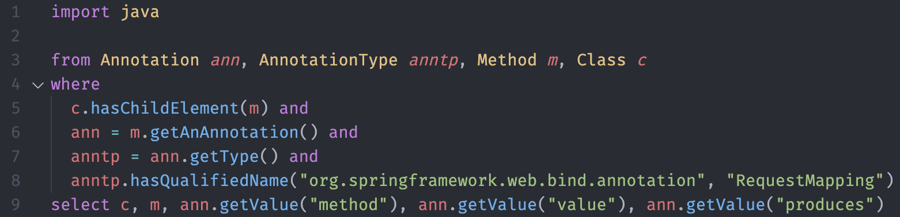

# List all the endpoints

- let's observe how the application declare endpoints
  - it should be within controller files
- what are the characteristics or the definitions?
  - find the patterns and confirm your results

```java
import org.springframework.http.HttpStatus;
import org.springframework.web.bind.annotation.*;
import org.springframework.beans.factory.annotation.*;
import org.springframework.boot.autoconfigure.*;
import java.util.List;
import java.io.Serializable

@RestController
@EnableAutoConfiguration
public class CommentsController {
  @Value("${app.secret}")
  private String secret;

  @CrossOrigin(origins = "*")
  @RequestMapping(value = "/comments", method = RequestMethod.GET, produces = "application/json")
  List<Comment> comments(@RequestHeader(value="x-auth-token") String token) {
    User.assertAuth(secret, token);
    return Comment.fetch_all();
  }
  [...]
}
```

