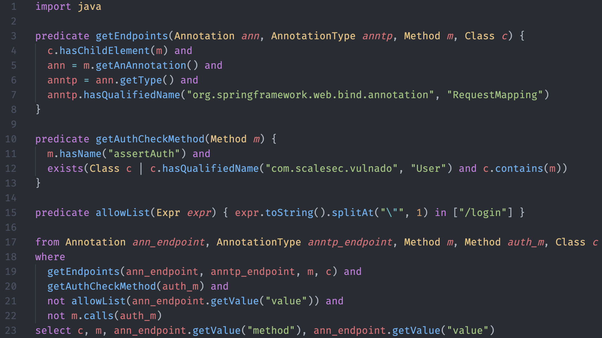

# List all public endpoint

```java
  @CrossOrigin(origins = "*")
  @RequestMapping(value = "/comments", method = RequestMethod.GET, produces = "application/json")
  List<Comment> comments(@RequestHeader(value="x-auth-token") String token) {
    User.assertAuth(secret, token);
    return Comment.fetch_all();
  }

  @CrossOrigin(origins = "*")
  @RequestMapping(value = "/comments", method = RequestMethod.POST, produces = "application/json", consumes = "application/json")
  Comment createComment(@RequestHeader(value="x-auth-token") String token, @RequestBody CommentRequest input) {
    return Comment.create(input.username, input.body);
  }
```


