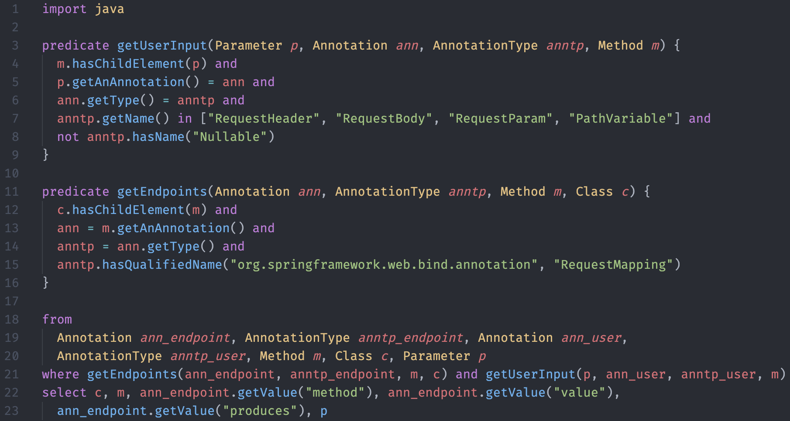

# List all the user input

```java
  @CrossOrigin(origins = "*")
  @RequestMapping(value = "/comments", method = RequestMethod.POST, produces = "application/json", consumes = "application/json")
  Comment createComment(@RequestHeader(value="x-auth-token") String token, @RequestBody CommentRequest input) {
    return Comment.create(input.username, input.body);
  }

  @CrossOrigin(origins = "*")
  @RequestMapping(value = "/comments/{id}", method = RequestMethod.DELETE, produces = "application/json")
  Boolean deleteComment(@RequestHeader(value="x-auth-token") String token, @PathVariable("id") String id) {
    return Comment.delete(id);
  }
```

