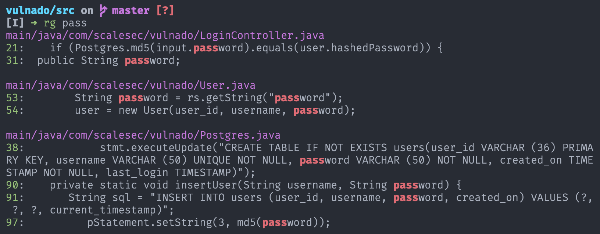
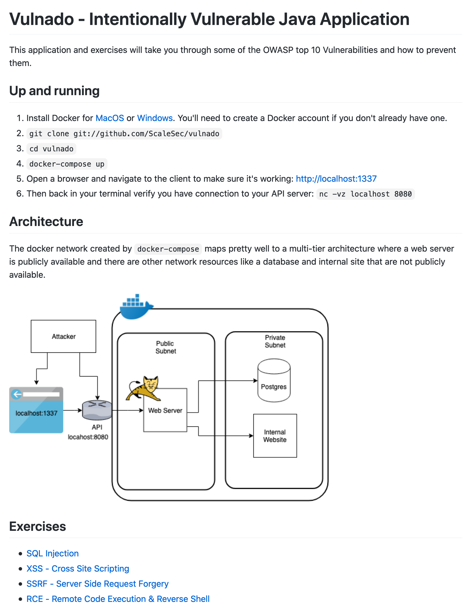
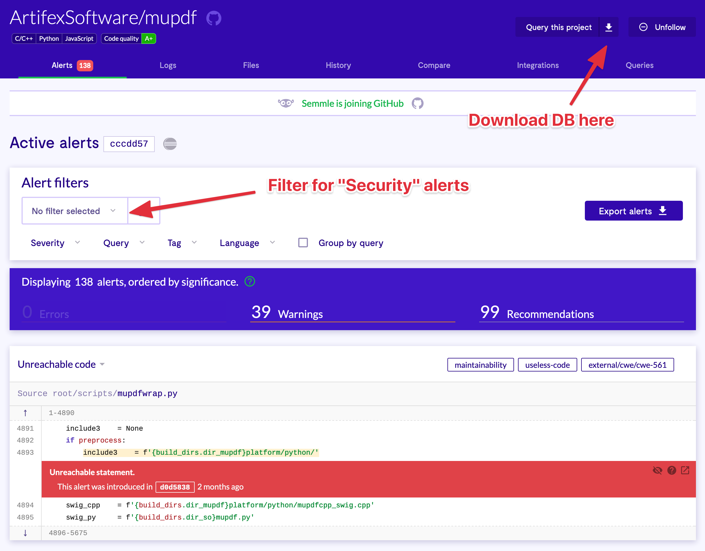
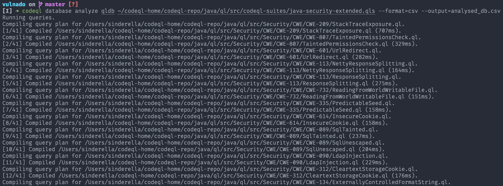
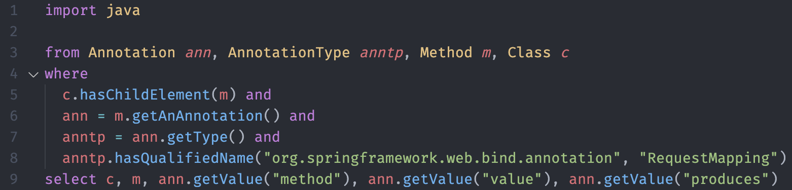
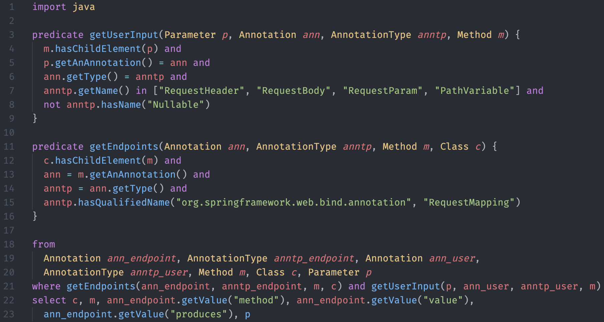

# Introduction to CodeQL (formerly known as Semmle QL)

👋 by Thanat Sirithawornsant, Senior Security Engineer, Citrix 🥳
# What is CodeQL?

- CodeQL is advertised as a variant analysis tool.
- It is a query language which has its own syntax.
- It can be used to find a piece of code in a code base, not necessarily bugs or defects.
- It can be used as part of you CI/CD pipelines to detect bad smells.
- Free for research and open source


## I am comfortable with grep, so I could just stick with that 🤔


## Or even ripgrep 💭



# well, how about unsafe deserialisation vulnerabilities? 😟


# Example Vulnerable Java Application 😑

https://github.com/ScaleSec/vulnado

- written in Java based on spring framework
- MVC model
- with some writeup

# Getting Started 🧐

CodeQL offers 2 ways to use their tool

1. CodeQL CLI for engineers
2. LGTM.com -> CodeQL Platform

## CodeQL CLI 🥂

Instructions: https://help.semmle.com/codeql/codeql-cli/procedures/get-started.html

- can compile a database for CodeQL locally
    - allowing engineers to do experiments and research locally
- can easily run batches on queries with ease

## LGTM.com 🖖

- can be used straight away on their platform for open source projects
- fancy UI
- a bit slower than querying locally, probably because of shared environment or some sort of restrictions
- once the project has been imported, the database can be exported

# Create a database 🛠🖍


# Running the built-in queries 🧰

## Issues ⚠️

| Issue                                               | Type    | Location                                          | Line Number    |
| --------------------------------------------------- | ------- | ------------------------------------------------- | -------------- |
| Query built without neutralizing special characters | error   | /src/main/java/com/scalesec/vulnado/User.java     | 49, 40, 49, 44 |
| Use of a broken or risky cryptographic algorithm    | warning | /src/main/java/com/scalesec/vulnado/Postgres.java | 67, 32, 67, 63 |
| Executing a command with a relative path            | warning | /src/main/java/com/scalesec/vulnado/Cowsay.java   | 11, 28, 11, 33 |

## Run `codeql database analyze` to run queries in a batch



# List all the endpoints

- let's observe how the application declare endpoints
  - it should be within controller files
- what are the characteristics or the definitions?
  - find the patterns and confirm your results

```java
import org.springframework.http.HttpStatus;
import org.springframework.web.bind.annotation.*;
import org.springframework.beans.factory.annotation.*;
import org.springframework.boot.autoconfigure.*;
import java.util.List;
import java.io.Serializable

@RestController
@EnableAutoConfiguration
public class CommentsController {
  @Value("${app.secret}")
  private String secret;

  @CrossOrigin(origins = "*")
  @RequestMapping(value = "/comments", method = RequestMethod.GET, produces = "application/json")
  List<Comment> comments(@RequestHeader(value="x-auth-token") String token) {
    User.assertAuth(secret, token);
    return Comment.fetch_all();
  }
  [...]
}
```

# List all public endpoint

```java
  @CrossOrigin(origins = "*")
  @RequestMapping(value = "/comments", method = RequestMethod.GET, produces = "application/json")
  List<Comment> comments(@RequestHeader(value="x-auth-token") String token) {
    User.assertAuth(secret, token);
    return Comment.fetch_all();
  }

  @CrossOrigin(origins = "*")
  @RequestMapping(value = "/comments", method = RequestMethod.POST, produces = "application/json", consumes = "application/json")
  Comment createComment(@RequestHeader(value="x-auth-token") String token, @RequestBody CommentRequest input) {
    return Comment.create(input.username, input.body);
  }
```


# List all the user input

```java
  @CrossOrigin(origins = "*")
  @RequestMapping(value = "/comments", method = RequestMethod.POST, produces = "application/json", consumes = "application/json")
  Comment createComment(@RequestHeader(value="x-auth-token") String token, @RequestBody CommentRequest input) {
    return Comment.create(input.username, input.body);
  }

  @CrossOrigin(origins = "*")
  @RequestMapping(value = "/comments/{id}", method = RequestMethod.DELETE, produces = "application/json")
  Boolean deleteComment(@RequestHeader(value="x-auth-token") String token, @PathVariable("id") String id) {
    return Comment.delete(id);
  }
```



# User Input Taint Tracking

## we could

- list all the endpoints
  - including public ones, with allow list even
- list all the user input
  - including URL query, HTTP body, URL path

## Now, we would like to see which input ends up in an unsafe method

# I am sold! How do I get started?

## RTFM

https://help.semmle.com/QL/learn-ql/

### References

https://help.semmle.com/QL/ql-handbook/index.html

### Built-in queries

https://help.semmle.com/wiki/display/JAVA/Java+queries
https://github.com/github/codeql/tree/master/java/ql/src/Security/CWE

## CTF challenges with real bugs

https://securitylab.github.com/ctf

## Real bugs advisories

https://blog.semmle.com/

## Or just use the aforementioned example and play with it

# Thank you 2600 staff members and the community 🙏